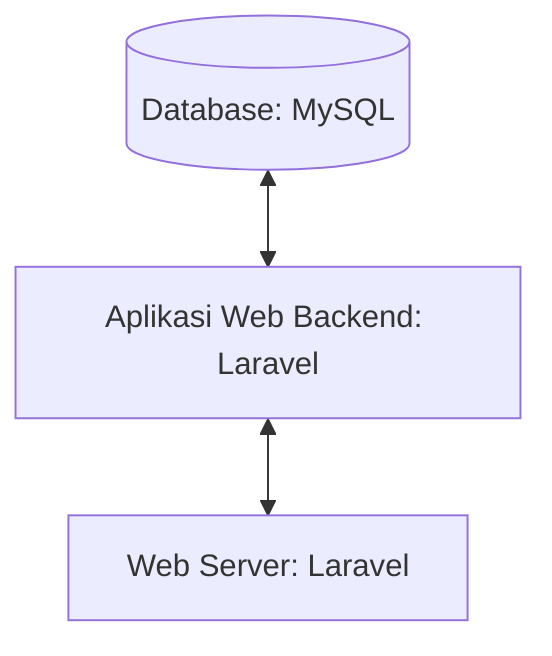

## 1.1 Latar Belakang

Absensi adalah metode untuk mencatat berapa banyak mahasiswa tidak hadir disetiap mata kuliah. Absensi online ini adalah pencatatan kehadiran dengan sistem cloud yang terhubung dengan database secara realtime, ini akan menyimpan data absensi secara otomatis tanpa perlu melakukan rekapitulasi. Selain itu, data absensi yang telah masuk dapat diakses di mana pun dan kapan pun, dengan catatan harus tetap terhubung dengan jaringan internet.

## 1.2. Deksripsi Teknologi Informasi
Roll Call

## 1.3. Branding

Merk : Roll Call

Tagline : Absen mudah dan simpel

Campaign : Membuat aplikasi sederhana dimana penggunanya dapat dengan mudah mengisi absensi secara online.

Target user :
•	Semua usia 
•	Orang yang menyukai hal simpel mudah tapi bermanfaat
•	Seseorang yang ingin mendisiplinkan dirinya sendiri 
•	

User experience theme:
•	Mudah
•	Simpel
•	Sederhana
•	Bermanfaat

   

## 2. User Story

sebagai | saya ingin bisa | sehingga | prioritas
---|---|---|---
Admin | Mengakses data user  | Bisa update data user dan menghapus data user | ⭐⭐⭐⭐⭐
Admin | Mengakses data transaksi  | Bisa melihat detail transaksi dan mengubah status transaksi | ⭐⭐⭐⭐⭐
Admin | Upload Product  | Banyak product yang bisa dipilih user  | ⭐⭐⭐⭐⭐
Admin | Edit Product  | Bisa merubah harga, deskripsi, nama product | ⭐⭐⭐⭐⭐
Admin | Hapus Product  | Bisa menghapus product | ⭐⭐⭐⭐⭐
Pengguna | Melihat semua product | Mendapatkan banyak piliha furnitur  | ⭐⭐⭐⭐
Pengguna | Melihat detail furnitur | Bisa meliahat deskripsi lengkap furnitur  | ⭐⭐⭐⭐
Pengguna | Menyimpan furnitur yang akan dibeli didalam keranjang | Dapat memilih kembali furnitur sebelum di checkout  | ⭐⭐⭐⭐
Pengguna | Memilih jasa kirim | Bisa menyesuaikan dengan jasa kirim yang diinginkan  | ⭐⭐⭐
Pengguna | Memilih Media Pembayaran | Bisa menyesuaikan payment yang dipunya  | ⭐⭐⭐⭐⭐

## 3. Struktur Data

## 4. Arsitektur Sistem

## 5. Teknologi, Library, dan Framework

- UI/UX Design : Figma
- Web Server   : Laragon
- Text Editor  : VS Code
- Browser      : Chrome
- Library      : Laravel Jetstream
- Framework    : Laravel
- Database     : MySQL
  

## 6. Desain User Experience dan User Interface

Landing Page 

Details Page

Succsess Page

## 7. Demonstrasi Video

Link youtube nya

## 8. Bagaimana mesin komputasi dan sistem operasi berperan dalam produk teknologi informasimu ?

Link youtube nya di detik jawaban ini

## 9. Bagaimana algoritma, struktur data, dan bahasa pemrograman berperan dalam produk teknologi informasimu ?

Link youtube nya di detik jawaban ini

## 10. Bagaimana metode pengembangan perangkat lunak / Software Development Life Cycle berperan dalam produk teknologi informasimu ?

Link youtube nya di detik jawaban ini

## 11. Bagaimana database / sistem basis data berperan dalam produk teknologi informasimu ?

Link youtube nya di detik jawaban ini
