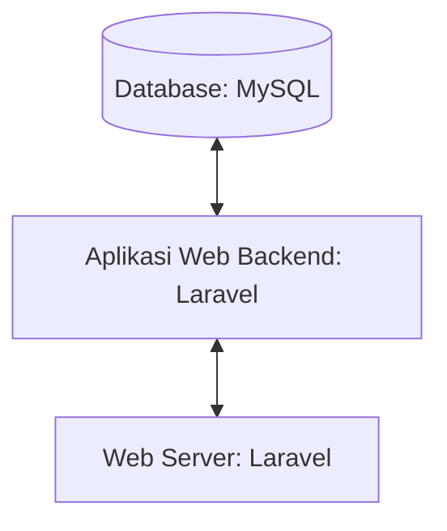

## 1.1 Latar Belakang

FurniCraft adalah platform daring yang memungkinkan pengguna untuk menjelajahi, memilih, dan membeli berbagai jenis furnitur untuk kebutuhan rumah, perkantoran, atau dekorasi interior. FurniCraft menawarkan beragam produk furnitur seperti sofa, meja, kursi, lemari, tempat tidur, serta peralatan dan aksesori dekorasi. Pengguna dapat mencari produk berdasarkan gaya, harga, bahan, atau merek. Website ini berfokus pada memberikan pengalaman belanja yang praktis dan nyaman dengan informasi produk yang jelas, gambar berkualitas tinggi, dan deskripsi yang rinci. Tujuan utama dari website ini adalah untuk memenuhi kebutuhan konsumen dalam hal furnitur dan dekorasi interior dengan kualitas tinggi dan pengalaman belanja yang memuaskan secara daring.

## 1.2. Deksripsi Teknologi Informasi

FurniCraft menyediakan pengalaman belanja furnitur yang nyaman, praktis, dan berkualitas tinggi untuk konsumen. Dengan menawarkan beragam produk dan gaya, inovasi teknologi untuk pengalaman yang lebih baik, pelayanan pelanggan yang responsif, serta fokus pada keberlanjutan dan kualitas, website ini bertujuan untuk memenuhi dan melebihi ekspektasi konsumen, menjadi pemain terkemuka di pasar furnitur online, dan menjadikan dekorasi interior yang lebih mudah diakses bagi semua.

## 1.3. Branding

Merk : FurniCraft

Tagline : "Fulfill your house with beautiful furniture"

Campaign : Membuat Website sedrehana dimana penggunanya dapat dengan mudah mendokorsi ruangannya tanpa harus bepergian.

Target user :
- Orang-orang yang memiliki rumah atau apartemen dan ingin mendekorasi atau mengubah tampilan interior ruangan mereka dengan lebih baik.
- Desainer interior atau profesional yang mencari sumber inspirasi atau alat bantu desain untuk proyek klien mereka.
- Mereka yang mencari cara praktis untuk merancang ulang ruangan mereka tanpa menghabiskan waktu berlebihan atau biaya mahal.
- Individu yang mencari inspirasi dekorasi interior yang segar dan ingin belajar lebih banyak tentang tren dan ide-ide dekorasi terbaru.
- Mereka yang ingin mengganti dekorasi interior rumah mereka sesuai dengan musim atau perubahan tren tanpa harus menghadapi kerumitan yang berlebihan.

User experience theme:
- Sederhana
- Kreativitas
- Kenyamanan
- Warna : Bernuansa Modern dan Ceria White/Light Pink

   

## 2. User Story

sebagai | saya ingin bisa | sehingga | prioritas
---|---|---|---
Admin | Mengakses data user  | Bisa update data user dan menghapus data user | ⭐⭐⭐⭐⭐
Admin | Mengakses data transaksi  | Bisa melihat detail transaksi dan mengubah status transaksi | ⭐⭐⭐⭐⭐
Admin | Upload Product  | Banyak product yang bisa dipilih user  | ⭐⭐⭐⭐⭐
Admin | Edit Product  | Bisa merubah harga, deskripsi, nama product | ⭐⭐⭐⭐⭐
Admin | Hapus Product  | Bisa menghapus product | ⭐⭐⭐⭐⭐
Pengguna | Melihat semua product | Mendapatkan banyak piliha furnitur  | ⭐⭐⭐⭐
Pengguna | Melihat detail furnitur | Bisa meliahat deskripsi lengkap furnitur  | ⭐⭐⭐⭐
Pengguna | Menyimpan furnitur yang akan dibeli didalam keranjang | Dapat memilih kembali furnitur sebelum di checkout  | ⭐⭐⭐⭐
Pengguna | Memilih jasa kirim | Bisa menyesuaikan dengan jasa kirim yang diinginkan  | ⭐⭐⭐
Pengguna | Memilih Media Pembayaran | Bisa menyesuaikan payment yang dipunya  | ⭐⭐⭐⭐⭐

## 3. Struktur Data

## 4. Arsitektur Sistem

## 5. Teknologi, Library, dan Framework

- UI/UX Design : Figma
- Web Server   : Laragon
- Text Editor  : VS Code
- Browser      : Chrome
- Library      : Laravel Jetstream
- Framework    : Laravel
- Database     : MySQL
  

## 6. Desain User Experience dan User Interface

Landing Page 

Details Page

Succsess Page

## 7. Demonstrasi Video

Link youtube nya

## 8. Bagaimana mesin komputasi dan sistem operasi berperan dalam produk teknologi informasimu ?

Link youtube nya di detik jawaban ini

## 9. Bagaimana algoritma, struktur data, dan bahasa pemrograman berperan dalam produk teknologi informasimu ?

Link youtube nya di detik jawaban ini

## 10. Bagaimana metode pengembangan perangkat lunak / Software Development Life Cycle berperan dalam produk teknologi informasimu ?

Link youtube nya di detik jawaban ini

## 11. Bagaimana database / sistem basis data berperan dalam produk teknologi informasimu ?

Link youtube nya di detik jawaban ini
